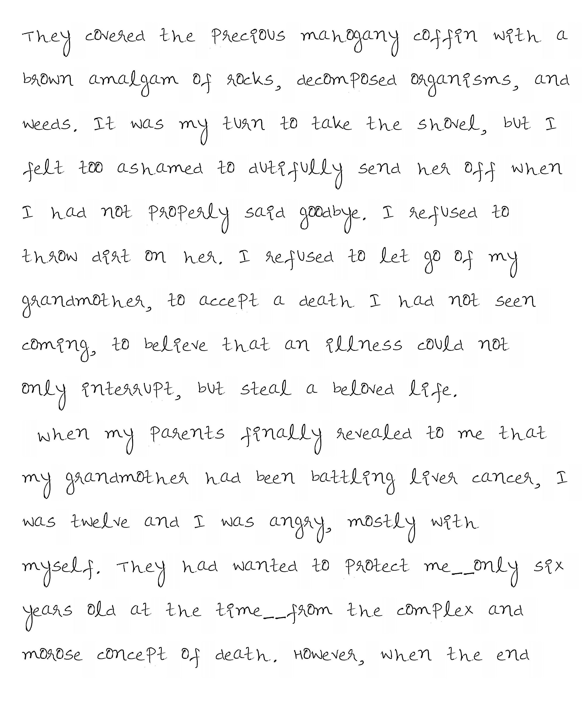

## Text to Handwriting (PDF)
Convert a text document into a handwritten PDF document

## Running the program:
- [X] python 3.5 or 3.6
- [X] dependencies from requirements.txt

```
 $ pip install -r requirements.txt
 ```

## Sample

<p align="center">    </p>
